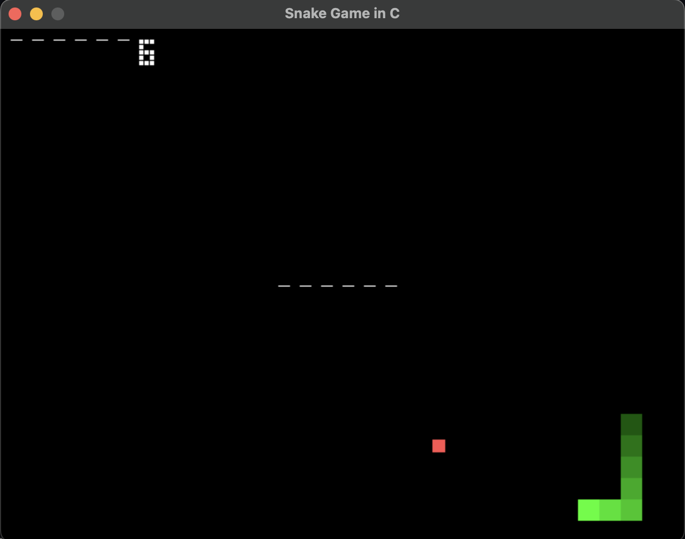

# 🐍 PixelSnake

> A retro-style Snake Game written in pure C using SDL2, built for fun, performance, and pixel aesthetics.



---

## 🎮 Features

- Built in C with SDL2 (no external dependencies)
- Gradient-style snake body
- Pixel-style score display and game messages
- Pause (P), Restart (R), and clean visuals
- Speed increases with score

---

## 🧱 Build Instructions (macOS/Linux)

Make sure you have SDL2 installed via Homebrew or apt:

```bash
# macOS (with Homebrew)
brew install sdl2

# Linux (Ubuntu/Debian)
sudo apt-get install libsdl2-dev

Then compile and run:
```bash
clang -std=c11 SnakeGame.c -o PixelSnake -I/opt/homebrew/include -L/opt/homebrew/lib -lSDL2
./PixelSnake
```

## 🚀 Controls

| Key          | Action          |
|--------------|-----------------|
| ↑ ↓ ← →      | Move Snake      |
| **P**        | Pause/Unpause   |
| **R**        | Restart Game    |

---

## 🤝 Contributing

Pull requests are welcome!  
If you find a bug or have a cool feature idea, feel free to fork and PR.  
See [CONTRIBUTING.md](CONTRIBUTING.md) for guidelines.

---

## 📄 License

This project is licensed under the [MIT License](LICENSE).

---

## 👨‍💻 Author

**Sandip Ghosh** ([@QuantumCoderrr](https://github.com/QuantumCoderrr))  
4th Year B.Tech | AI/ML Engineer in the Making 🚀

